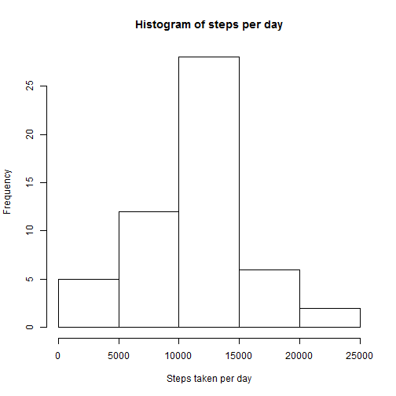
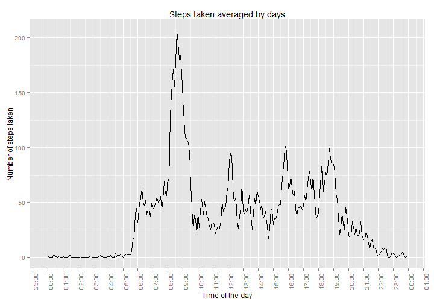
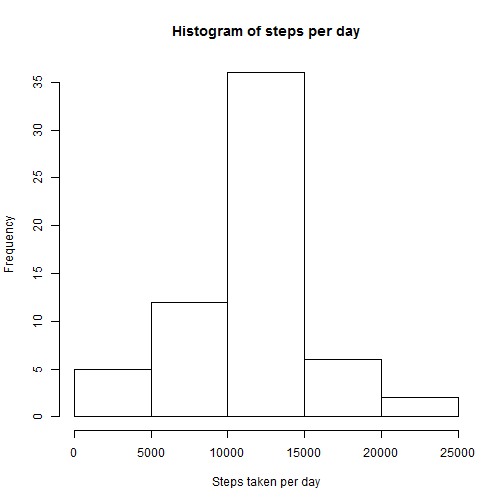
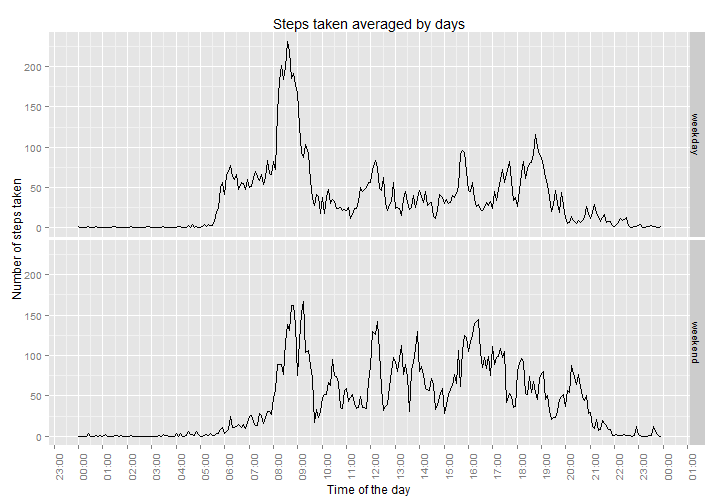

================================================================================

# Reproducible Research: Peer Assessment 1
done for Coursera Online Course

================================================================================

Loading libraries we need at the start...

```r
require(ggplot2)
require(scales)
require(plyr)
Sys.setlocale("LC_ALL", "english")
```


## Loading and preprocessing the data

The following code reads the data from the file (that should be in archive in current working directory).

```r
if(!file.exists("activity.csv")) unzip("activity.zip")
rawData <- read.csv("activity.csv")
```

Then we will do some processing. We will convert the intervals to suitable time format.

```r
processedData <- rawData
processedData$interval <- as.character(rawData$interval)

for (i in 1:nrow(rawData)) {
        len <- nchar(rawData$interval[i])
        if (len == 1) processedData$interval[i] <- paste0("000", rawData$interval[i])
        if (len == 2) processedData$interval[i] <- paste0("00", rawData$interval[i])
        if (len == 3) processedData$interval[i] <- paste0("0", rawData$interval[i])
}
processedData$time <- paste(as.character(rawData$date), " ", processedData$interval)
processedData$time <- strptime(processedData$time, "%Y-%m-%d %H%M")
```
Now we are ready to do some analysis.


## What is mean total number of steps taken per day?
We want to see what the mean and median per day are. To do that we will summarize the data removing existing NAs. 

```r
means <- aggregate(steps ~ date, data = processedData, sum, na.rm = TRUE)
```

Then we will make a histogram to see how skewed the data is. 

```r
hist(means$steps, main = "Histogram of steps per day", xlab = "Steps taken per day")
```

 

The number of steps looks not skewed so the mean and median should be close.

```r
meanPerDay <- as.integer(mean(means$steps))
medianPerDay <- as.integer(median(means$steps))
```
Mean steps taken per day is 10766 and the median steps taken per day is 10765.      


## What is the average daily activity pattern?

We want to see what the mean per intervals across days is. To do that we will summarize the data removing existing NAs.

```r
meansI <- aggregate(steps ~ interval, data = processedData, mean, na.rm = TRUE)
```

Then we will make a plot to see the average pattern of steps taken during the day.

```r
meansI$time <- strptime(meansI$interval, "%H%M")
qplot(time, steps, data = meansI, geom = "line", 
      xlab = "Time of the day", ylab = "Number of steps taken",
      main = "Steps taken averaged by days") + 
        scale_x_datetime(labels = date_format("%H:%M"), 
                         breaks = date_breaks("1 hour")) + 
        theme(text = element_text(size=12),
              axis.text.x = element_text(angle=90, vjust=1)) 
```

 

Then we will find out when the maximum exactly occure...

```r
amount <- as.integer(max(meansI$steps))
maxSteps <- format(strptime(meansI$interval[which.max(meansI$steps)], "%H%M"),"%H:%M") 
```
Maximum number of steps (206) is made on average at 08:35. 


## Imputing missing values

Firstly we will caluclate the numer of NAs in the original data set:

```r
NAsum <- sum(is.na(processedData$steps))
```
The number of NAs is 2304.

Every NA in the original data set will be replaced by the mean for this interval across the dates

```r
NAvec <- is.na(processedData$steps)
noNaData <- processedData
noNaData <- join(noNaData, meansI, by = "interval")
names(noNaData)[5] <- "mean"
noNaData$steps[NAvec] <- noNaData$mean[NAvec]
```

Now we have a data set with no missing values and can compare mean/median values for each day with the original data set.

```r
noNaMeans <- aggregate(steps ~ date, data = noNaData, sum)
hist(noNaMeans$steps, main = "Histogram of steps per day", xlab = "Steps taken per day")
```

 

```r
noNaMeanPerDay <- as.integer(mean(noNaMeans$steps))
noNaMedianPerDay <- as.integer(median(noNaMeans$steps))
```
With the NAs imputed as average for interval across the days the mean for the days is 10766 (vs 10766 with NAs in place) and the median is 10766 (vs 10765 with NAs in place).


## Are there differences in activity patterns between weekdays and weekends?
Firstly lets make an additional field in the data set (with NAs imputed) to define weekdays/weekends

```r
noNaData$day <- factor(weekdays(noNaData$time)=="Saturday" | weekdays(noNaData$time)=="Sunday", 
                       labels = c("weekday","weekend"))
```

Finally lets make a plot that will compare step patterns for weekdays/weekends:

```r
noNaMeansI <- aggregate(steps ~ interval + day, data = noNaData, mean)
noNaMeansI$time <- strptime(noNaMeansI$interval, "%H%M")
qplot(time, steps, data = noNaMeansI, geom = "line", 
      xlab = "Time of the day", ylab = "Number of steps taken",
      main = "Steps taken averaged by days") + 
        scale_x_datetime(labels = date_format("%H:%M"), 
                         breaks = date_breaks("1 hour")) + 
        theme(text = element_text(size=12),
              axis.text.x = element_text(angle=90, vjust=1)) +
        facet_grid(day ~ .)
```

 

We can see from the plot above that the pattern clearly differs for weekends.
